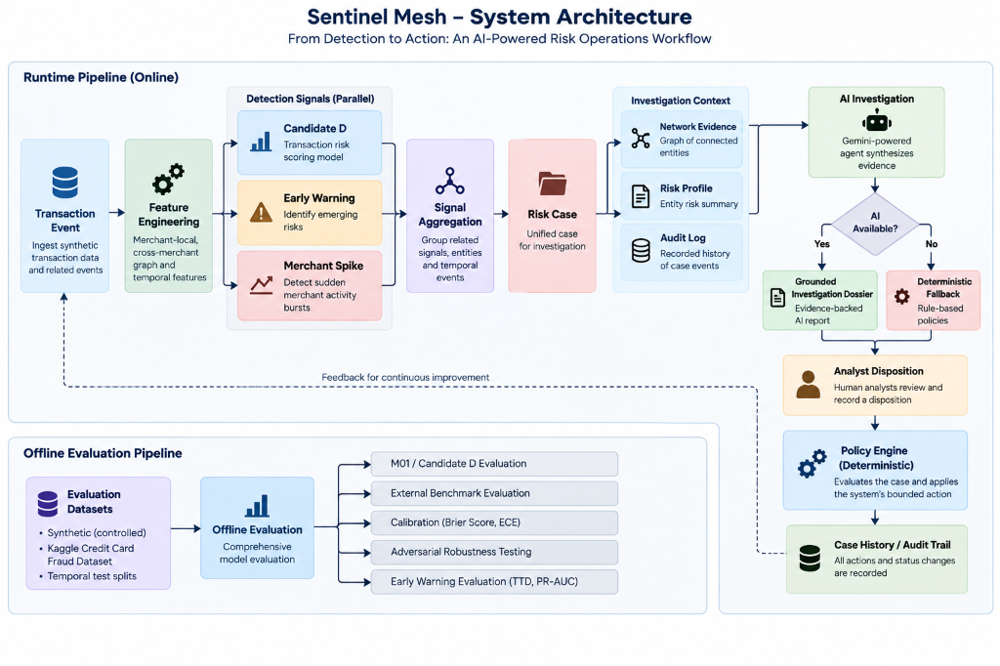

# Sentinel Mesh

## 1. Project Overview
Sentinel Mesh is an experimental, defensive payment-risk prototype and risk-operations platform. It is designed for detecting, investigating, and responding to suspicious and coordinated synthetic transaction activity. It tests whether merchant-local, cross-merchant relationship, and temporal signals can identify coordinated abuse earlier while controlling false positive cost. It also demonstrates an autonomous, AI-driven risk investigation agent powered by Gemini, which synthesizes cross-merchant evidence to justify risk decisions transparently.

## 2. Razorpay AI Risk Manager Alignment

Sentinel Mesh is aligned with Razorpay's **AI Risk Manager** track.

### Problem Addressed

Digital payment ecosystems face fraudulent transactions, coordinated abuse,
merchant-level fraud spikes, and evolving attack patterns. Sentinel Mesh
provides a defensive risk-operations workflow for detecting suspicious
activity, aggregating related signals, investigating the evidence, and
supporting analyst decisions.

### Track Alignment

| Razorpay AI Risk Manager Requirement | Sentinel Mesh |
|---|---|
| Detect a class of financial loss | Fraudulent and coordinated transaction abuse |
| Working detector | Candidate D risk detector + supporting detectors |
| Measured performance | Precision, Recall, F1, PR-AUC, TTD and cost |
| Held-out evaluation | Temporal test splits and isolated external benchmark |
| False-positive awareness | Explicit false-positive cost and normalized cost analysis |
| AI meaningfully used | AI-assisted evidence investigation |
| Safe / defense-only | No offensive capability; AI does not autonomously authorize actions |
| Failure handling | Deterministic fallback when AI is unavailable |
| Explainability / verification | Related signals, network evidence, investigation dossier and audit trail |

### Why It Fits

Rather than treating fraud detection as a single binary prediction,
Sentinel Mesh models the problem as a risk-operations workflow:

**Detect → Correlate → Investigate → Verify → Disposition → Audit**

The system combines machine-learning detection with network and temporal
evidence, early-warning signals, merchant-spike monitoring, AI-assisted
investigation, deterministic fallback behavior, and human analyst review.

## 3. How Sentinel Mesh Works

Sentinel Mesh models fraud detection as a comprehensive risk-operations workflow, clearly distinguishing between automated detection signals and the subsequent investigation and analyst workflow.

1. **Transaction/Event**: The system ingests synthetic transaction data and related events.
2. **Feature Engineering**: Causal features are extracted across merchant-local, cross-merchant graph, and temporal dimensions.
3. **Detection Signals**:
   - **Candidate D**: The core transaction risk scoring model.
   - **Early Warning**: Runs in parallel to identify emerging risks using causal features.
   - **Merchant Spike**: Monitors for sudden bursts of activity at specific merchants.
4. **Signal Aggregation**: Deterministic grouping of related signals, entities, and temporal events.
5. **Risk Case**: Aggregated signals are promoted to a unified Risk Case for investigation.
6. **Investigation Context**:
   - **Network Evidence**: Graph representation of interconnected entities.
   - **Risk Profile**: Summary of the entity's risk exposure.
   - **Audit Log**: Recorded history of case events and analyst actions.
7. **AI Investigation**: A Gemini-powered agent synthesizes the evidence.
   - **AI Available?**: The system checks if the AI service is accessible.
   - **Grounded Investigation Dossier**: If available, the AI generates a detailed, evidence-backed dossier.
   - **Deterministic Fallback**: If unavailable, the system gracefully degrades to rule-based policies.
8. **Analyst Disposition**: Human analysts review the case, evidence, and AI investigation output and record a disposition.
9. **Policy Engine**: Deterministically evaluates the case and applies the system's bounded policy action.
10. **Case History / Audit Trail**: All actions and status changes are recorded in the case audit trail.

## 4. System Architecture



## 5. Core Capabilities
- **Candidate D transaction risk scoring:** The core detection model balancing speed and coverage.
- **Local/network/temporal features:** Causal feature extraction across merchant-local, cross-merchant graph, and temporal/emerging-risk dimensions.
- **Merchant Spike detection:** Identifies sudden bursts of activity at specific merchants.
- **Merchant Spike timeline visualization:** Visualizes baseline vs. live observation metrics.
- **EarlyWarningDetector:** Runs in parallel to enrich investigation candidates using causal features and validation-selected thresholds.
- **Parent/child alert aggregation:** Deterministic entity and temporal grouping of signals into parent cases.
- **Related signals:** Surfacing related alerts and events within a case.
- **Analyst disposition:** Workflow for analysts to review, add notes, and disposition cases.
- **Audit trail:** Immutable logging of case status changes and actions.
- **Agentic investigation:** A Gemini-powered risk investigator that securely interfaces with Sentinel Mesh tools to collect evidence.
- **Network Evidence Graph:** Visual representation of the interconnected entities involved in a risk case.
- **AI failure fallback:** Graceful degradation to deterministic rule-based policies if the AI is unavailable.
- **Deterministic PolicyEngine:** Translates risk assessments into bounded financial actions (e.g., Hold, Enhanced Verification, Monitor).
- **External transaction fraud benchmark:** Evaluation against external datasets to validate transaction-level capabilities.
- **Probability calibration analysis:** Ensures risk scores are well-calibrated probabilities.
- **Adversarial robustness evaluation:** Testing the models against synthetic perturbations like timing jitter and low-and-slow execution.

## 6. Runtime Architecture
The Sentinel Mesh architecture is split into runtime detection/investigation and offline evaluation/experimentation.
At runtime, transactions flow through causal feature extraction, are scored by Candidate D and Early Warning detectors, and are aggregated into Risk Cases. The AI Agent can then investigate these cases, presenting evidence and a Network Evidence Graph to an analyst, who can disposition the case. A deterministic Policy Engine ultimately decides the bounded action.
For a detailed breakdown, see [docs/ARCHITECTURE.md](docs/ARCHITECTURE.md).

## 7. Setup
Create a Python 3.12 virtual environment, install the pinned dependencies, and set up the necessary environment variables.

### Backend
Open a PowerShell terminal and run:
```powershell
cd sentinel-mesh
python -m venv venv
.\venv\Scripts\Activate.ps1
python -m pip install -r requirements.txt
python -m uvicorn src.api.main:app --host 127.0.0.1 --port 8000
```

### Frontend
Open a new PowerShell terminal and run:
```powershell
cd sentinel-mesh\frontend
& "D:\npm.cmd" run dev
```
*(Note: Depending on your Windows environment, you may need to invoke `npm run dev` through the actual npm executable, e.g., `& "C:\Program Files\nodejs\npm.cmd" run dev`)*

## 8. Environment Variables
Copy the example environment file and configure it:
```powershell
cp .env.example .env
```
Edit `.env` and insert your `GOOGLE_API_KEY`.
**Important:** Never commit your `.env` file. It contains sensitive keys and is ignored by Git.

## 9. Testing
To run the backend deterministic tests:
```powershell
.\venv\Scripts\python -m pytest
```

To build the frontend for production:
```powershell
cd frontend
npm run build
```

## 10. Evaluation
- **M01:** Deterministic generation of a synthetic world dataset with organic and fraudulent transactions.
- **Candidate D:** The optimal balanced detector identified in M04-R, combining network synchronization and growth features.
- **External Benchmark:** Evaluates the transaction-level capability of the models on external datasets.
- **Calibration:** Analytical probability calibration to ensure reliable risk scores.
- **Robustness:** Synthetic adversarial perturbations (jitter, low-and-slow) to test model generalization.
Detailed evaluation reports and artifacts are available in the `docs/` and `artifacts/` directories.

## 11. Data Sources

### External Benchmark Dataset
The external fraud-detection benchmark uses the publicly available Kaggle Credit Card Fraud Detection dataset from the Machine Learning Group at Université de Libre de Bruxelles (ULB).

https://www.kaggle.com/datasets/mlg-ulb/creditcardfraud

- Dataset: Credit Card Fraud Detection
- Source: Kaggle / Machine Learning Group (ULB)
- Size: 284,807 transactions
- Fraud cases: 492
- Features: Time, Amount, V1-V28, and Class

This dataset is used only for the isolated external benchmark evaluation and does NOT directly validate Sentinel Mesh's Candidate D network/temporal feature pipeline.

## 12. Security / Data Handling
- `.env` is ignored by Git to prevent leaking secrets.
- `sentinel.db` (the local SQLite database) is ignored.
- External benchmark datasets are ignored.
- Generated data and experiment artifacts in `data/` and `artifacts/` are not committed.
- There are no real credentials or PII in the repository.

## 13. Limitations
The system operates on synthetic data and has specific constraints regarding its evaluation and real-world applicability. For a full list of limitations, see [docs/LIMITATIONS.md](docs/LIMITATIONS.md).

## 14. Repository Structure
```text
sentinel-mesh/
├── .env.example
├── .gitignore
├── README.md
├── requirements.txt
├── artifacts/          # Ignored: Model artifacts and evaluation plots
├── data/               # Ignored: Generated synthetic datasets
├── docs/               # Documentation (Architecture, Experiments, etc.)
├── frontend/           # React + Vite frontend application
├── src/                # Backend source code (API, Agent, Models, Simulation)
└── tests/              # Pytest test suite
```

## Tech Stack

### Frontend
- React
- Vite
- JavaScript / JSX
- CSS

### Backend
- Python
- FastAPI
- Uvicorn
- Pydantic

### Machine Learning
- Scikit-learn
- Pandas
- NumPy

### Database
- SQLite
- Python sqlite3

### AI Investigation
- Google Gemini API
- Deterministic fallback when AI is unavailable

### Data and Evaluation
- Synthetic transaction data for the controlled environment
- Kaggle Credit Card Fraud Detection dataset for the external benchmark
- PR-AUC, Precision, Recall, F1, Brier Score, ECE, Time-to-Detection (TTD), and cost analysis

### Development
- Git
- GitHub
- Python virtual environment
- PowerShell
