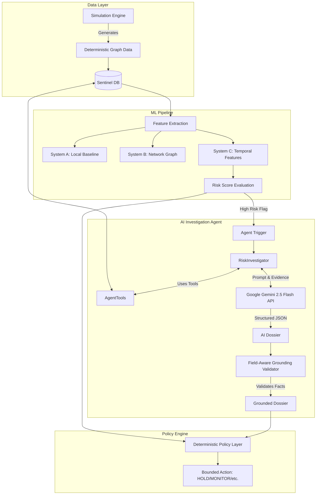

# Architecture

Below is the overarching architecture of the Sentinel Mesh pipeline and AI Investigation Agent.

## System Architecture

## System Definitions

### System A: Merchant-Local Baseline (M02)
**Definition:** A model that evaluates risk using only information available to a single merchant at the time of the transaction.
**Features:** 
- `amount`
- `local_account_txns_1h`, `local_account_txns_24h`
- `local_device_txns_1h`, `local_device_txns_24h`
- `local_account_amt_1h`, `local_account_amt_24h`
**Constraints:** Cannot access cross-merchant velocities, graph structures, or future events. Evaluated on the strictly disjoint `train`, `validation`, and `test` cohorts of `m01-world-v1`.

### System B: Cross-Merchant Network (M03)
**Definition:** System A + access to cross-merchant relationship features via Sentinel Mesh (Device graphs, Network Group graphs, Account interaction graphs).
**Features:**
- System A features
- `network_device_accounts_24h`, `network_device_merchants_24h`
- `network_group_accounts_24h`, `network_group_merchants_24h`
- `network_account_devices_24h`, `network_account_merchants_24h`, `network_account_devices_7d`, `network_account_merchants_7d`

### System C: Temporal & Emerging Risk (M04)
**Definition:** System B + temporal sequences and emerging threat intelligence.
**Features:**
- System B features
- `temporal_device_txns_5m`, `temporal_account_txns_5m`
- `temporal_network_sync_5m`, `temporal_network_sync_15m`
- `temporal_account_new_devices_1h`, `temporal_device_new_accounts_1h`

## Feature Contract
Features must be extracted causally. For a transaction $T$ at time $t$, all historical aggregates rely strictly on events $T_{prev}$ where $timestamp(T_{prev}) < t$. Ground truth labels (`is_abuse`, `campaign_id`, etc.) must not enter the feature engineering pipeline at any time.

## Evaluation Pipeline
1. **Training:** Model fit on the `train` cohort.
2. **Validation:** Threshold selection using precision-recall optimization on the `validation` cohort.
3. **Testing:** Single-pass evaluation on the `test` cohort using frozen thresholds. TTD is evaluated post-prediction by comparing the first flagged transaction in a campaign against the campaign's global start time.

### 5. Deterministic Policy Layer (src/api/policy.py)
- Evaluates the LLM-generated dossier alongside the quantitative case features (Risk Score, Amount).
- **Synthetic Cost Model**: Configurable economics modeling expected_fraud_loss vs false_positive_cost and manual_review_cost.
- **Policy Engine**: A strict ruleset that prevents an LLM hallucination from holding funds arbitrarily. Evaluates Grounding statuses and evidence sufficiency.
- Returns a bounded action (MONITOR, MANUAL_REVIEW, ENHANCED_VERIFICATION, or HOLD) independently of the LLM's recommendation.
